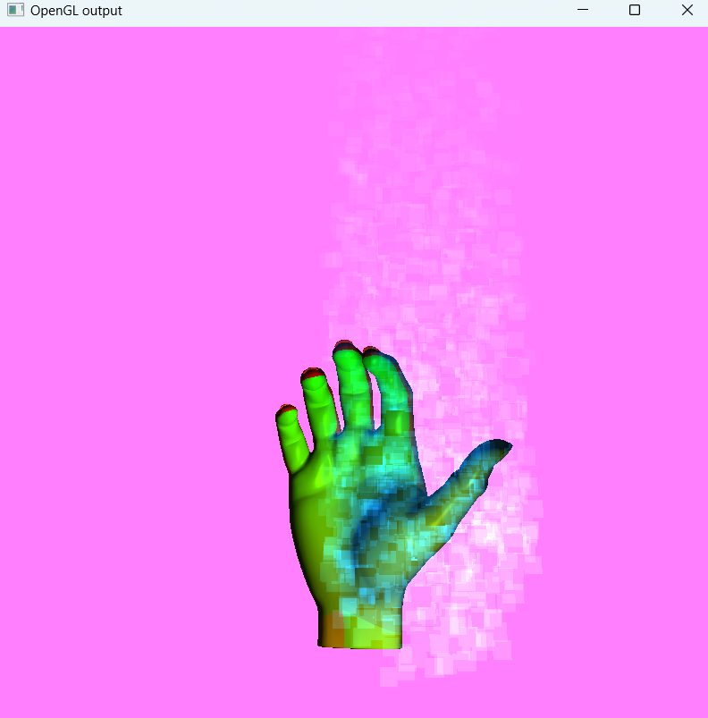

# Lighting & Particles

**Environment**  
`Windows 11, VS Code (C/C++ Extension Pack + CMake)`

**Compiler**  
`Visual Studio Community 2022 Release - x86_amd64`

**Path**  
`./build/src/Debug/Hand.exe`

---

**Pause & Resume**   
`Enter`

**Motion Switch**  
`1, 2, 3`

---

**Camera Control**

`Flat Motion: WASD`

`Rotate: QE`

`Zoom: MB1 MB3`

**Camera Transition**

`Mark: SPACE`

`Toggle: T`

---
**Lighting & Particle System** (based on Phong Model)

`Flat Motion: WASD`

`Normal Motion: [,] [.]`

