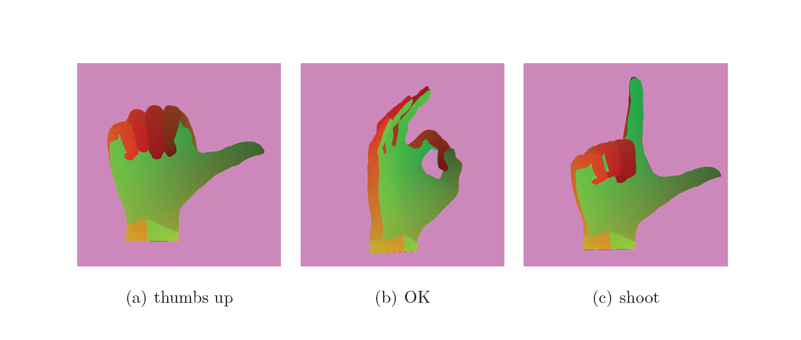

# Pipeline

**Base**   
`hand-cmake.v1`

**Environment**  
`Windows 11, VS Code (C/C++ Extension Pack + CMake)`

**Compiler**  
`Visual Studio Community 2022 Release - x86_amd64`

**Path**  
`./build/src/Debug/Hand.exe`

---

**Pause & Resume**   
`Enter, MB1, MB2`

**Motion Switch**  
`left, right, 1, 2, 3`

---

