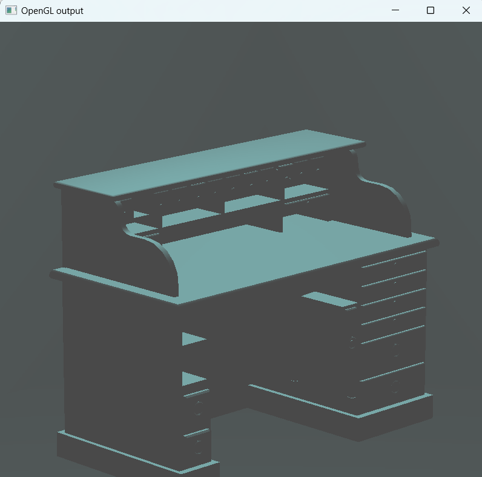
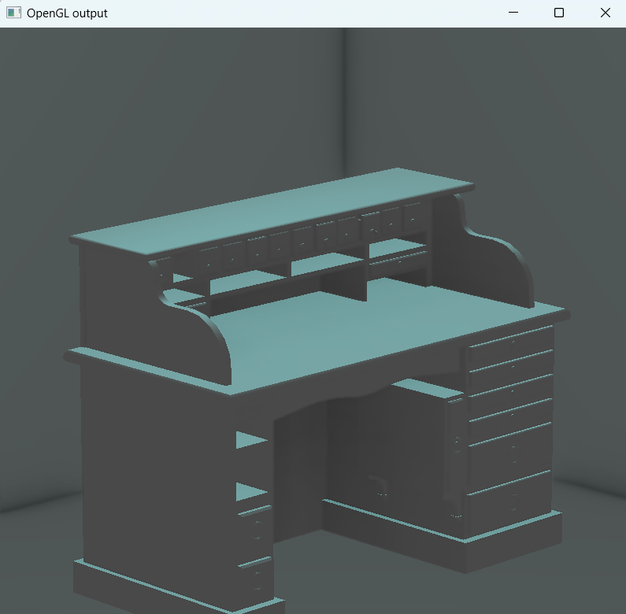

# OpenGL-based SSAO implementation

**Environment**  
`Windows 11, VS Code (C/C++ Extension Pack + CMake)`

**Compiler**  
`Visual Studio Community 2022 Release - x86_amd64`

**Path**  
`./build/src/Debug/cgfxxxxssao.exe`

---

**Camera Control**

`Flat Motion: WASD`

`View Around: Mouse Dragging`

`Zoom: Mouse Wheel Scrolling`

**SSAO Control**

`Toggle: Q`

